# Hướng dẫn tạo template CSKH và gửi chiến dịch A.C tại các đơn vị

*Hướng dẫn này dùng để các đơn vị sẽ tạo chiến dịch gửi tin thông báo cho Khách hàng sử dụng app SAWACO.*

## 1. Tạo Mẫu tin và Mẫu tin Gateway trên trang TCRM của đơn vị

### a) Tạo mẫu tin trong danh sách mẫu tin

- **Bước 1**: Vào **Quản lý** -> **Cài đặt** -> **Chức năng mới** -> **Danh sách mẫu tin**
  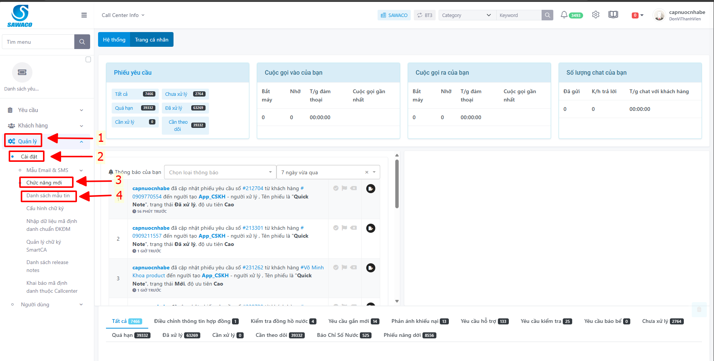

- **Bước 2**: Click vào nút hình dấu  để tạo mẫu tin
  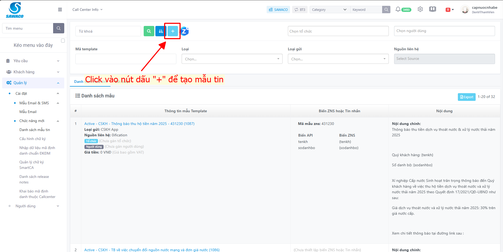

- **Bước 3**: Gồm có các thông tin cần điền vào template như sau:
  - **Mã template**: Điền tên của template.
  - **VMG Template ID**: Điền id muốn đặt.
  - **Chủ đề**: Điền chủ đề cần gửi vào đây.
  - **Loại gửi**: CSKH App.
  - **Nguồn liên hệ**: Thông báo.
  - **Nội dung**: Điền thông tin nội dung của tin nhắn và gán biến vào nội dung dưới dạng ví dụ `{tenkh}`, `{sodanhbo}`.
  - **File**: Click vào 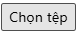 để add file vào template.
  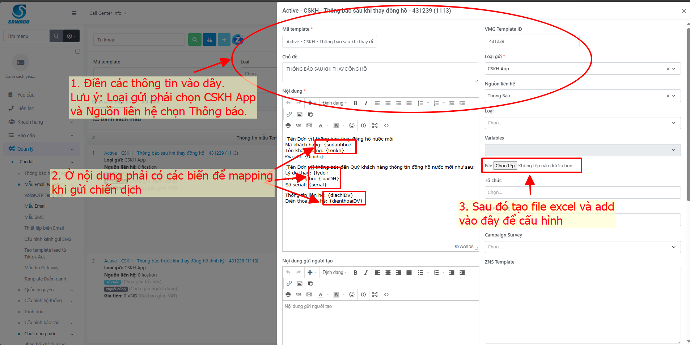

  - **Tổ chức và Người dùng**: Chọn theo đơn vị.
  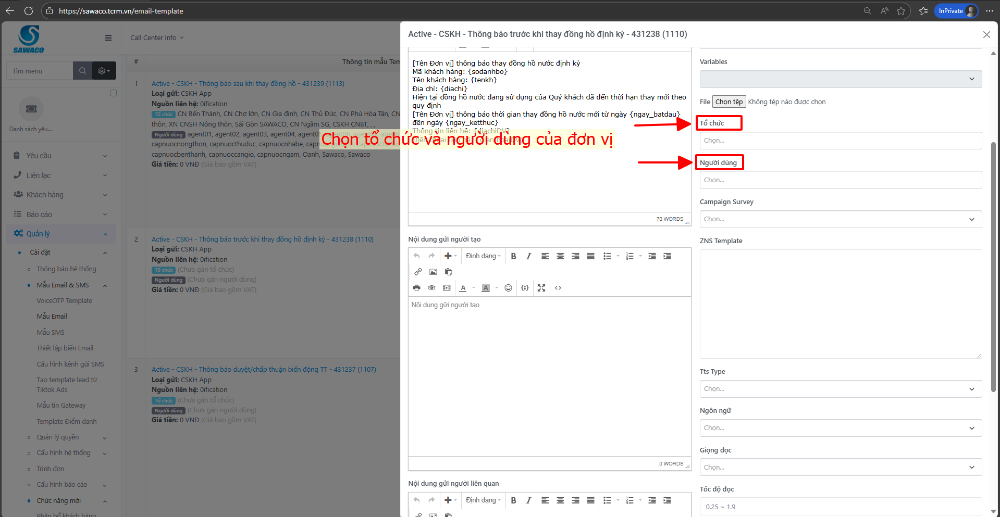

  - **Chuẩn bị file excel như sau**:
  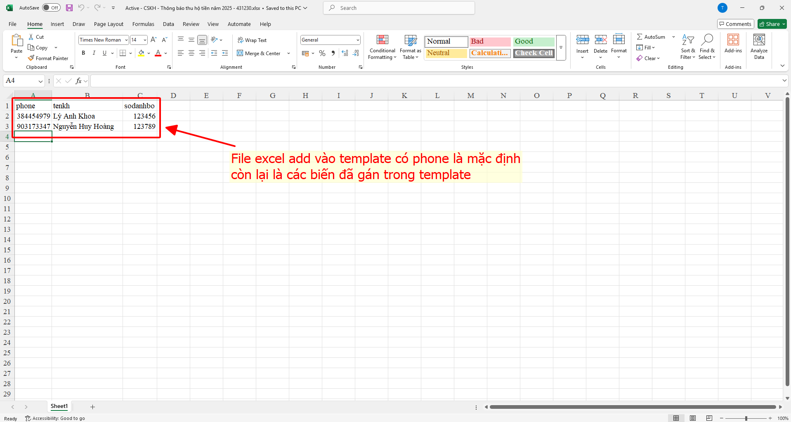

- **Bước 5**: Cấu hình biến của file excel sau khi đã tạo xong template
  - Click vào tên template vừa mới tạo.
    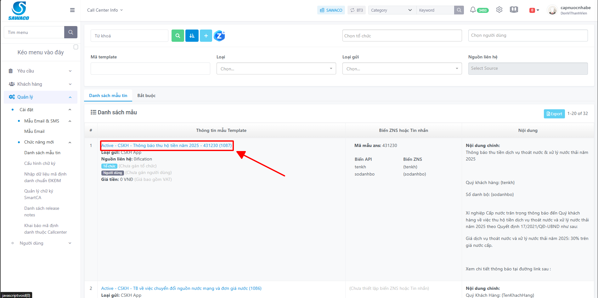
  - Bấm vào nút cấu hình.
    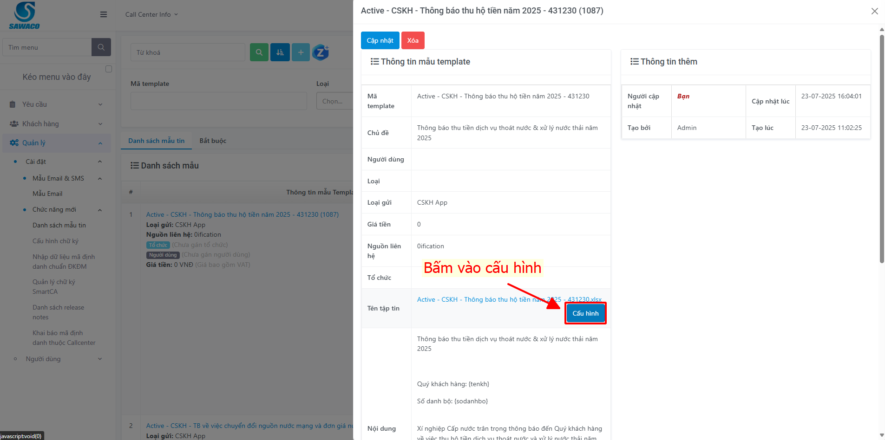
  - Mặc định là các biến sẽ là ignore, nhấn vào để gán lại cho đúng biến.
    
  - Sau đó nhấn 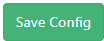 để lưu lại.

### b) Tạo Mẫu tin Gateway để gửi chiến dịch

- **Bước 1**: Click vào **Quản lý** -> **Cài đặt** -> **Mẫu Email & SMS** -> **Mẫu tin Gateway**
  

- **Bước 2**: Click vào hình dấu  hoặc  để thêm mới.

- **Bước 3**: Gồm những thông tin như ( Có thể tham khảo hình ở dưới):
  - **Tên mẫu tin**: Tên hiển thị bên ngoài
  - **Mẫu tin**: Lấy giá trị ở các mẫu tin có sẵn. (VD: template cskh mình đang tạo mẫu tin)
    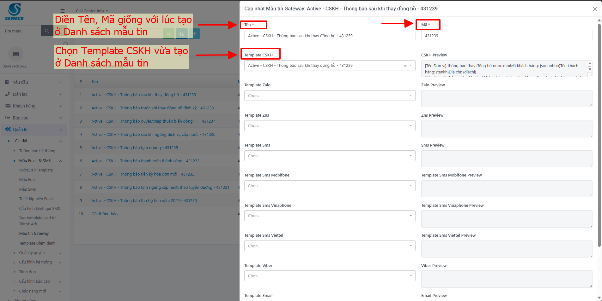
  - Chọn các biến để mapping với mẫu tin cskh.
    
  - Chọn gửi từ CSKH App.
    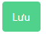

- **Bước 4**: Sau khi thiết lập xong cấu hình gửi tin thì lưu cấu hình lại.
  

## 2. Tạo và gửi chiến dịch CSKH tại trang TCRM của đơn vị

- **Bước 1**: Click vào **Khách hàng** -> **Chiến dịch tự động** -> **Quản lý chiến dịch**.
  

- **Bước 2**: Click vào nút dấu  để tạo chiến dịch

- **Bước 3**: Có các thông tin cần chọn như sau:
  - **Loại**: Chọn loại tin cần gửi ( ở đây là Gateway ).
  - **Biểu mẫu**: Chọn biểu mẫu cần gửi.
  - **Dowload template**: Tải File excel về nếu chưa có.
  - 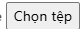 : Click vào đây để đẩy file lên.
  - Nhấn nút 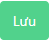 để bắt đầu tạo chiến dịch.
    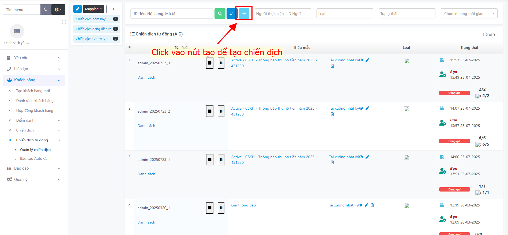

- **Bước 4**: Sau khi lưu xong, nhấn vào nút “play” để bắt đầu gửi chiến dịch.
  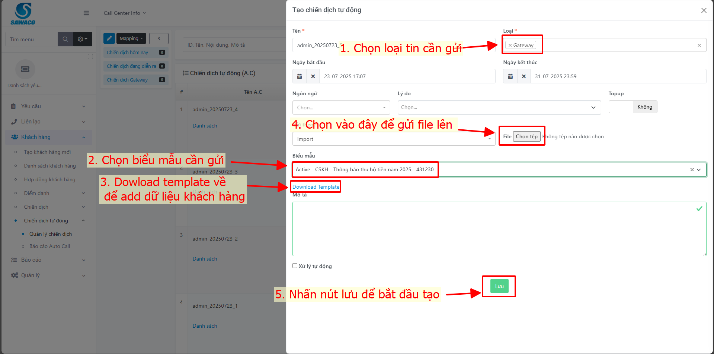
  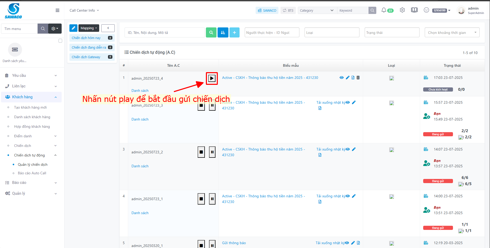
