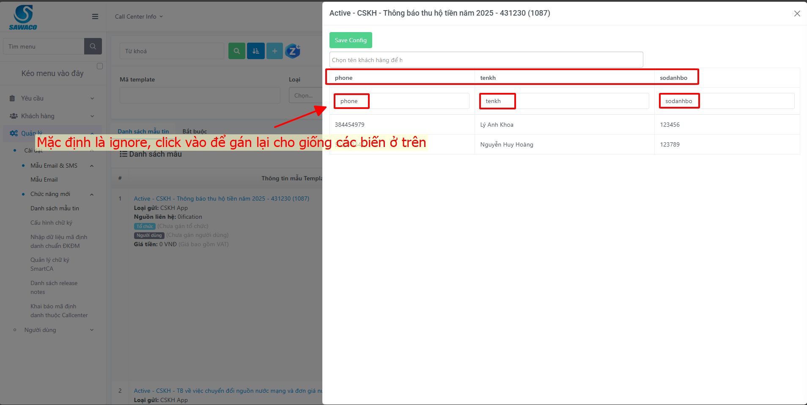
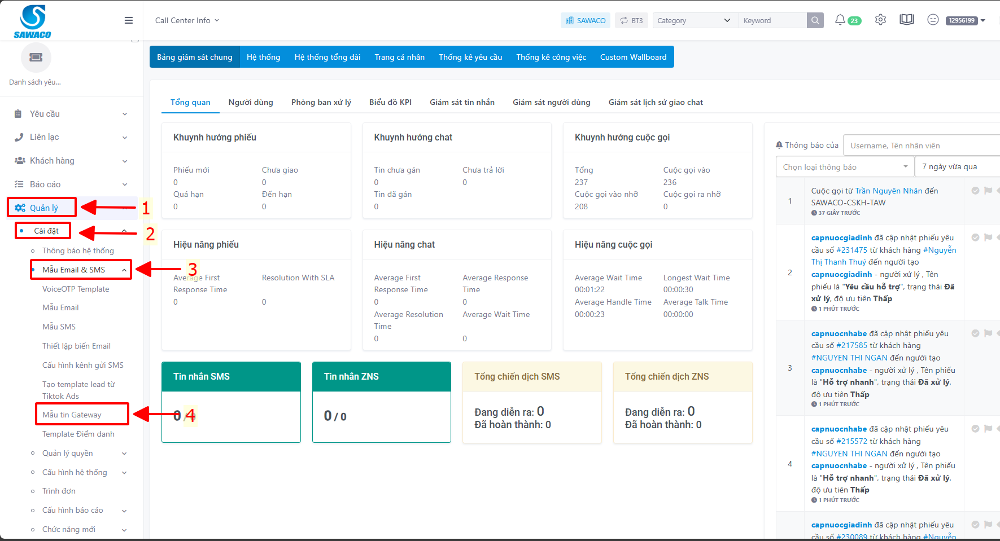
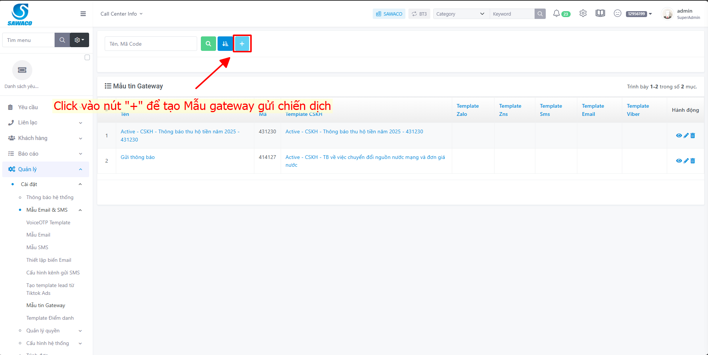
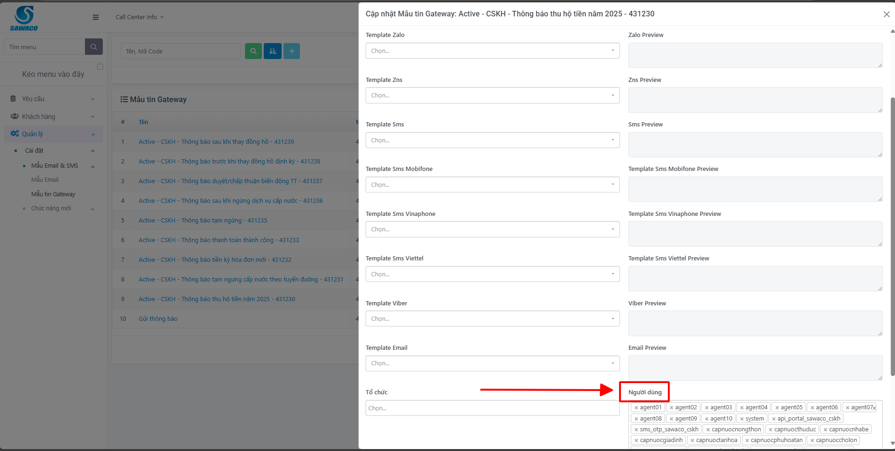
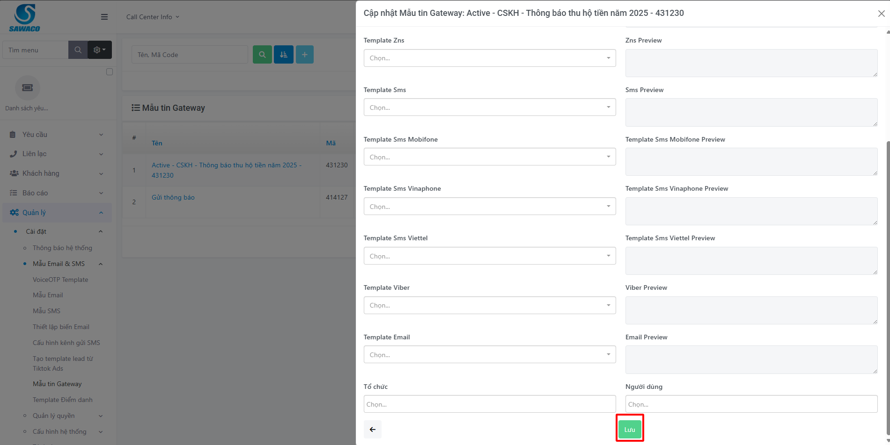

# Chiến dịch Tự động (Gateway)

Tính năng Chiến dịch Tự động cho phép Quản trị viên khởi tạo và gửi hàng loạt tin nhắn thông báo chăm sóc khách hàng (CSKH) dựa trên dữ liệu từ file Excel.

## Điều kiện tiên quyết

* [ ] File Excel chứa danh sách thông tin người nhận (Có thể tải về tệp biểu mẫu gốc trong hệ thống).
* [ ] Các thông tin và biến dữ liệu (như Tên KH, Số danh bộ, v.v...) đã được khai báo chuẩn trong file Excel.
* [ ] Tài khoản người dùng được cấp quyền truy cập Quản trị viên (Admin) hoặc Chăm sóc khách hàng.

***

## 1. Tạo Mẫu nội dung (Template)

Trước khi gửi chiến dịch, bạn phải tạo Mẫu tin nhắn (Template) và khai báo các biến giá trị tương ứng.

### Bước 1: Khởi tạo danh sách Mẫu tin

1. Nhấp chọn menu **Quản lý** > **Cài đặt**. .png>)
2. Chọn **Chức năng mới** > **Danh sách mẫu tin**. .png>)
3. Nhấp biểu tượng **Dấu cộng (+)** để thêm mẫu tin nhắn mới. 
4. Điền đầy đủ các thông số trong bảng dưới đây:

| Tên thông số           | Mô tả & Cách điền                                                                                                                                                          |
| ---------------------- | -------------------------------------------------------------------------------------------------------------------------------------------------------------------------- |
| **Mã template**        | Tên gợi nhớ của Template (ví dụ: `Thong_bao_nuoc_Q1`).                                                                                                                     |
| **VMG Template ID**    | ID hệ thống hoặc ID nhà cung cấp phát hành.                                                                                                                                |
| **Chủ đề**             | Tiêu đề hoặc nội dung chính cần nhắc đến.                                                                                                                                  |
| **Loại gửi**           | Chọn phương thức gửi (VD: **CSKH App**).                                                                                                                                   |
| **Nguồn liên hệ**      | Chọn **Thông báo** (hoặc tuỳ chọn phù hợp).                                                                                                                                |
| **Nội dung**           | Văn bản hiển thị cho khách hàng. **Lưu ý:** Nếu có trường dữ liệu động, đặt tên biến trong dấu ngoặc nhọn `{}` (VD: `Xin chào {tenkh}, Số danh bộ của bạn là {sodanhbo}`). |
| **File đính kèm**      | Nhấp vào **biểu tượng File** nếu cần đính kèm tài liệu vào tin nhắn.                                                                                                       |
| **Tổ chức/Người dùng** | Chọn phân quyền Đơn vị hoặc Nhân sự phụ trách mẫu này.                                                                                                                     |

5. Sau khi nhập thông tin, nhấn **Lưu** để khởi tạo Template. .png>) .png>)

### Bước 2: Cấu hình ánh xạ biến (Excel Mapping)

1. Từ **Danh sách mẫu tin**, nhấp vào tên Template bạn vừa tạo.
2. Tại màn hình chi tiết, nhấp biểu tượng **Cấu hình**.
3. Hệ thống sẽ liệt kê các cột ánh xạ từ file Excel lên các cột biến. Ban đầu, các trạng thái đều mặc định là **Ignore (Bỏ qua)**.
4. Chọn mũi tên thả xuống để **gán lại (map) từng cột Excel tương ứng** với các biến động `{}` được khai báo. 
5. Nhấn **Lưu (biểu tượng đĩa mềm)** để hoàn tất gán biến. 

***

## 2. Tạo Mẫu tin Gateway

Mẫu tin Gateway đóng vai trò kết nối trực tiếp Mẫu tin nhắn ở Bước 1 vào luồng Chiến dịch Tự động.

1. Bấm lại menu **Quản lý** > **Cài đặt**.
2. Chọn **Mẫu Email & SMS** > **Mẫu tin Gateway**. 
3. Nhấp biểu tượng **Dấu cộng (+)** để phân đoạn mẫu mới. 
4. Điền thông tin tương tự:
   * Tại dòng **Template CSKH**, hãy chọn đúng Mẫu tin bạn đã thiết lập ở Phần 1.
   * Tại dòng **Người dùng**, chọn tài khoản nhân viên được phép chạy chiến dịch này.
5. Nhấp nút **Lưu (biểu tượng đĩa mềm)**.  

***

## 3. Tạo và Kích hoạt Chiến dịch Gửi tin

1. Từ thanh menu chính, chọn **Khách hàng** > **Chiến dịch tự động**.
2. Nhấp chọn mục **Quản lý chiến dịch**. 
3. Nhấp biểu tượng **Dấu cộng (+)** để tạo dự án thông báo mới. 
4. Tại Form tạo Chiến dịch, thực hiện:
   * **Loại:** Chọn **Gateway**.
   * **Biểu mẫu:** Chọn **Mẫu tin Gateway** bạn vừa thao tác ở Phần 2.
   * **Tải lên File dữ liệu:** Nhấp vào biểu tượng chức năng **Upload** để tải Data KH (File Excel) lên hệ thống. _(Nhấp nút `Download template` nếu cần lấy cấu trúc cột cơ bản để làm lại file Excel)._
5. Nhấp nút **Lưu** để chuyển chiến dịch sang trạng thái Sẵn sàng.   
6. Khi cần tiến hành gửi thực tế, nhấp vào nút **Play (Kích hoạt - ▻)** trên danh sách tại dòng của chiến dịch.  

Ngay sau khi ấn Play, hệ thống sẽ tự động đối chiếu các biến ánh xạ và gọi thông báo tới Khách hàng. Hãy tải thử chiến dịch test cho 1-2 Khách hàng nội bộ để kiểm tra tỷ lệ đối chiếu biến `{}` thành công, trước khi thực hiện cho tệp Data lớn.
