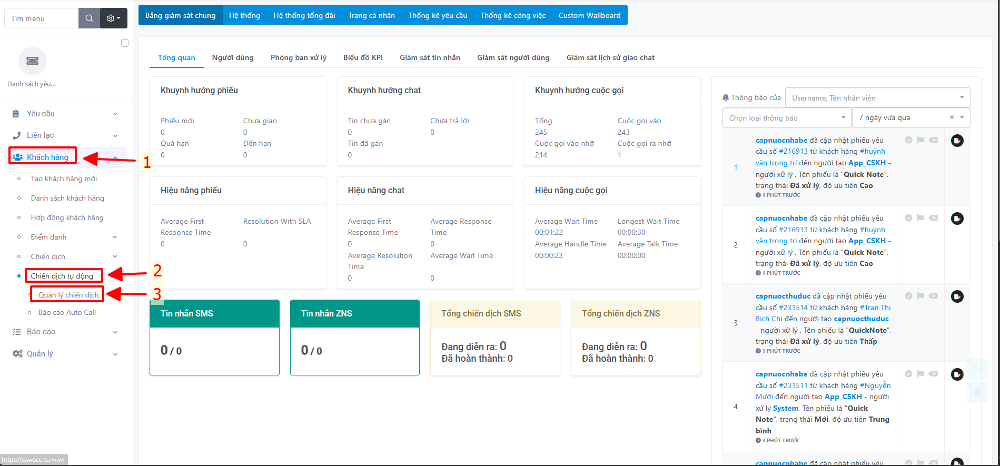

# Chiến dịch Tự động (Gateway)

_Hướng dẫn nãy dùng để các đơn vị sẽ tạo chiến dịch gửi tin thông báo cho Khách hàng (ví dụ sử dụng app SAWACO)._

## 1. Tạo Mẫu tin và Mẫu tin Gateway trên trang TCRM của đơn vị

### a) Tạo mẫu tin trong danh sách mẫu tin

* **Bước 1**: Vào **Quản lý** -> **Cài đặt** -> **Chức năng mới** -> **Danh sách mẫu tin** .png>) .png>)
* **Bước 2**: Click vào nút hình dấu **+** để tạo mẫu tin .png>)
* **Bước 3**: Gồm có các thông tin cần điền vào template như sau:
  * **Mã template**: Điền tên của template.
  * **VMG Template ID**: Điền id muốn đặt.
  * **Chủ đề**: Điền chủ đề cần gửi vào đây.
  * **Loại gửi**: CSKH App.
  * **Nguồn liên hệ**: Thông báo.
  * **Nội dung**: Điền thông tin nội dung của tin nhắn và gán biến vào nội dung dưới dạng ví dụ `{tenkh}`, `{sodanhbo}`.
  * **File**: Click vào để add file vào template.
  * **Tổ chức và Người dùng**: Chọn theo đơn vị. .png>) .png>) .png>) .png>)
  * **Chuẩn bị file excel như sau**: .png>) .png>)
* **Bước 5**: Cấu hình biến của file excel sau khi đã tạo xong template
  * Click vào tên template vừa mới tạo.
  * Bấm vào nút **cấu hình**.
  * Mặc định là các biến sẽ là ignore, nhấn vào để gán lại cho đúng biến. .png>)
  * Sau đó nhấn **Lưu** để lưu lại. .png>)

### b) Tạo Mẫu tin Gateway để gửi chiến dịch

* **Bước 1**: Click vào **Quản lý** -> **Cài đặt** -> **Mẫu Email & SMS** -> **Mẫu tin Gateway** .png>)
* **Bước 2**: Click vào nút tạo để tạo mẫu Gateway .png>)
* **Bước 3**: Điền các thông tin giống với lúc tạo mẫu tin ở danh sách mẫu tin. **Template CSKH** chọn template vừa mới tạo, **Người dùng**: Chọn người dùng cần thấy để gửi chiến dịch. .png>)
* **Bước 4**: Nhấn nút **Lưu** để tạo mẫu tin Gateway thành công. .png>)

## 2. Tạo và gửi chiến dịch CSKH tại trang TCRM của đơn vị

* **Bước 1**: Click vào **Khách hàng** -> **Chiến dịch tự động** -> **Quản lý chiến dịch**. .png>)
* **Bước 2**: Click vào nút dấu **+** để tạo chiến dịch .png>)
* **Bước 3**: Có các thông tin cần chọn như sau:
  * **Loại**: Chọn loại tin cần gửi (ở đây là **Gateway**). .png>)
  * **Biểu mẫu**: Chọn biểu mẫu cần gửi. 
  * **Dowload template**: Tải File excel về nếu chưa có.  
  * Click vào biểu tượng Upload để đẩy file lên. .png>)
  * Nhấn nút **Lưu** để bắt đầu tạo chiến dịch. .png>)
* **Bước 4**: Sau khi lưu xong, nhấn vào nút “play” để bắt đầu gửi chiến dịch. .png>) !\[Gửi chiến dịch]\(#]\(../assets/extracted\_images/chien\_dich\_cskh/image25.png)
