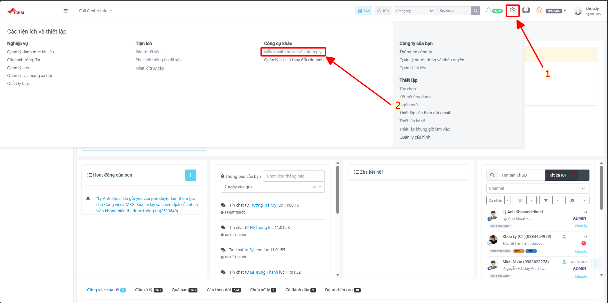
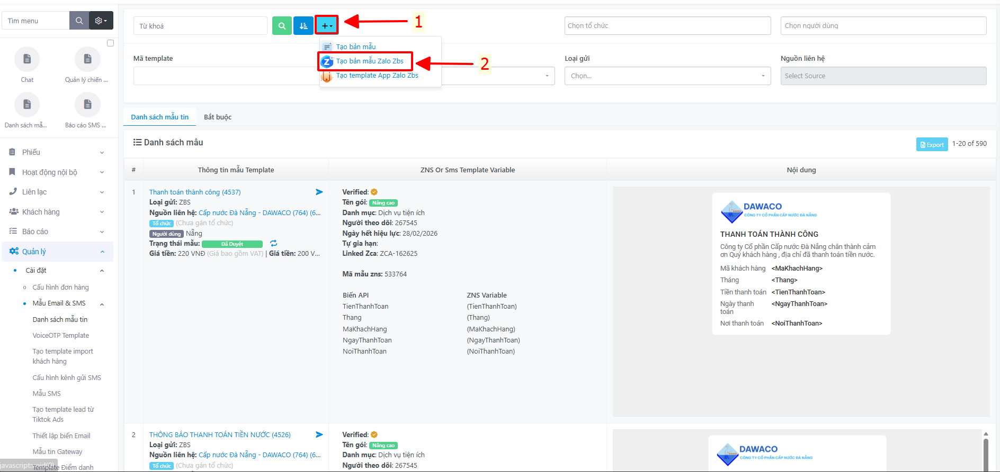
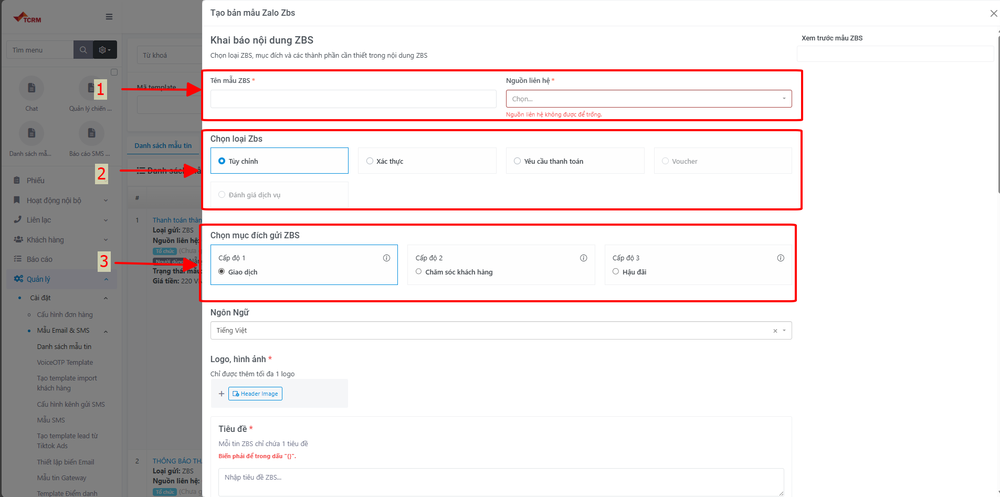
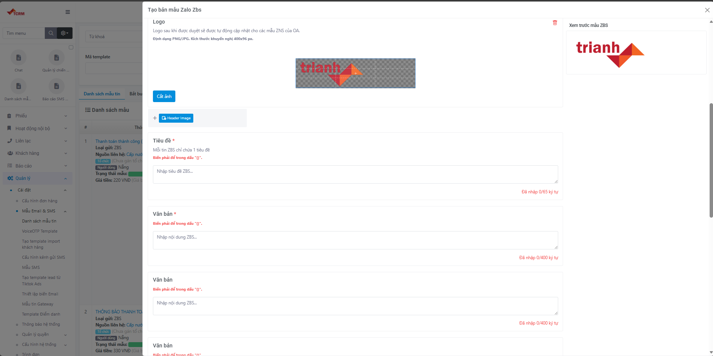
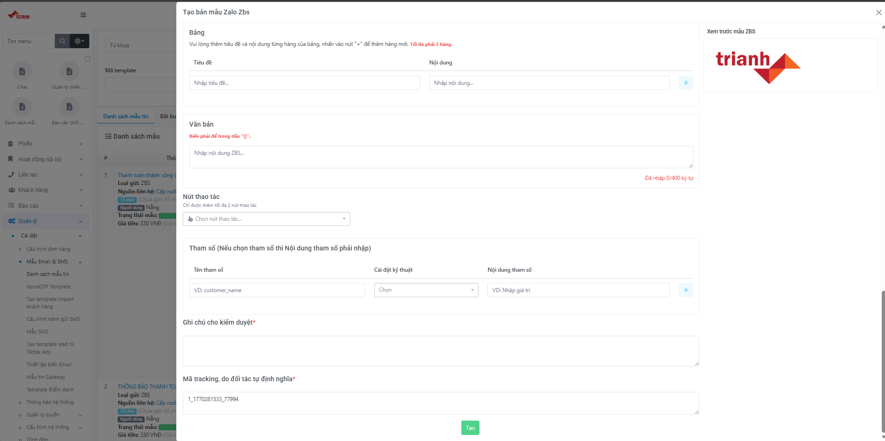

<h2 style="margin-top:0">📨 ZBS Template Message</h2>

<strong>ZBS (Zalo Business Solution)</strong> là dịch vụ gửi tin nhắn thông báo chủ động từ <strong>Zalo OA</strong> của doanh nghiệp tới người dùng Zalo — không yêu cầu người dùng phải quan tâm OA trước. Nội dung template phải được <strong>Zalo kiểm duyệt và phê duyệt</strong> trước khi đưa vào sử dụng.

<ul style="display: grid; grid-template-columns: 1fr 1fr; gap: 5px;">
<li>• Mẫu Tùy Chỉnh</li>
<li>• Yêu cầu thanh toán</li>
<li>• Đánh giá dịch vụ</li>
<li>• Voucher</li>
<li>• Xác thực (OTP)</li>
</ul>

📌 Tài liệu này hướng dẫn chi tiết <strong>quy trình tạo Template ZBS trên hệ thống CRM TriAnh Solutions</strong> — nền tảng chuyển đổi số đang phục vụ hơn <strong>500 doanh nghiệp</strong> trên toàn quốc.

---

## I. Tổng quan

**TriAnh Solutions** là công ty công nghệ với hơn 16 năm kinh nghiệm, chuyên cung cấp các giải pháp chuyển đổi số cho doanh nghiệp bao gồm: CRM, OmniChannel Contact Center, SMS Brandname, ZNS/ZBS và tích hợp API. Hệ thống CRM của TriAnh tích hợp sẵn tính năng tạo và quản lý **Template ZBS**, giúp doanh nghiệp chủ động gửi thông báo đến khách hàng một cách nhanh chóng và đúng quy định.

### 1. Lịch sử cập nhật
| Ngày | Người Cập Nhật | Version | Mô tả |
| :--- | :--- | :--- | :--- |
| 27/01/2026 | Lý Anh Khoa | Ver 1.0 | Khởi tạo tài liệu hướng dẫn |

### 2. Mục lục

| STT | Nội dung |
| :---: | :--- |
| 1 | [Quy trình tạo template ZBS — Mẫu Tùy Chỉnh](#1-quy-trình-tạo-template-zbs-mẫu-tùy-chỉnh) |
| 2 | [Quy trình tạo template ZBS — Mẫu Yêu cầu thanh toán](#2-quy-trình-tạo-template-zbs-mẫu-yêu-cầu-thanh-toán) |
| 3 | [Quy trình tạo template ZBS — Mẫu Đánh giá dịch vụ](#3-quy-trình-tạo-template-zbs-mẫu-đánh-giá-dịch-vụ) |
| 4 | [Quy trình tạo template ZBS — Mẫu Voucher](#4-quy-trình-tạo-template-zbs-mẫu-voucher) |
| 5 | [Quy trình tạo template ZBS — Mẫu Xác thực](#5-quy-trình-tạo-template-zbs-mẫu-xác-thực) |

---

## II. Các bước thực hiện

### 1. Quy trình tạo template ZBS (Mẫu Tùy Chỉnh)

<h3 style="margin-top:0">🔹 Bước 1: Truy cập menu quản lý</h3>

Tại giao diện chính của CRM, tìm và nhấn vào icon <strong>Mẫu Email, SMS, ZNS</strong>.

Hình 1: Truy cập menu Mẫu Email, SMS, ZNS

---

<h3 style="margin-top:0">🔹 Bước 2: Khởi tạo bản mẫu</h3>
<ol>
<li>Chọn biểu tượng <strong>Dấu +</strong> tại góc giao diện.</li>
<li>Nhấn chọn dòng <strong>Tạo bản mẫu Zalo ZBS</strong>.</li>
</ol>

Hình 2: Thao tác khởi tạo template mới

---

<h3 style="margin-top:0">🔹 Bước 3: Thiết lập nội dung chi tiết</h3>

<h4>Thông tin cơ bản</h4>
<ul>
<li><strong>Tên mẫu ZBS:</strong> Đặt tên gợi nhớ để quản lý nội bộ.</li>
<li><strong>Nguồn liên hệ:</strong> Chọn đúng Zalo OA đang hoạt động.</li>
<li><strong>Loại ZBS:</strong> Chọn <strong>Mẫu Tùy Chỉnh</strong>.</li>
<li><strong>Mục đích:</strong> Lựa chọn mục đích phù hợp (Giao dịch, Thông báo...).</li>
</ul>

Hình 3: Thiết lập các trường thông tin cơ bản

<h4>Nội dung hiển thị & Tham số</h4>
<ul>
<li><strong>Logo:</strong> Sử dụng ảnh kích thước <strong>400x96 px</strong>, yêu cầu <strong>xóa background</strong> trước khi upload.</li>
<li><strong>Tiêu đề & Văn bản:</strong> Bắt buộc nhập đầy đủ. Nếu sử dụng biến động, đặt tên biến trong dấu <code>{ten_bien}</code>.</li>
<li><strong>Phần Bảng:</strong> Định nghĩa "Tiêu đề" (nhãn) và "Nội dung" (giá trị hoặc biến trong <code>{}</code>).</li>
<li><strong>Tham số:</strong> Tuyệt đối <strong>không xóa dấu ngoặc <code>{}</code></strong> tại mục này.</li>
<li><strong>Ghi chú kiểm duyệt:</strong> Giải thích ngắn gọn mục đích gửi tin để Zalo duyệt nhanh hơn.</li>
</ul>

Hình 4: Thiết lập hình ảnh và nội dung tin nhắn

Hình 5: Hoàn thiện tham số và ghi chú kiểm duyệt

👉 Sau khi kiểm tra kỹ, nhấn nút Tạo để hoàn tất gửi yêu cầu cho Zalo.

---

### 2. Quy trình tạo template ZBS (Mẫu Yêu cầu thanh toán)

Mẫu tin nhắn này yêu cầu tuân thủ nghiêm ngặt các quy định về tài chính của Zalo:

<h3 style="margin-top:0">🔹 Đặc điểm riêng của Mẫu Thanh toán</h3>

Tại <strong>Bước 3</strong>, mục <strong>Loại ZBS</strong> hãy chọn: <strong>Yêu cầu thanh toán</strong>.

Các bước còn lại (<strong>Bước 1, 2</strong> và phần thông tin cơ bản) thực hiện tương tự <a href="#1-quy-trình-tạo-template-zbs-mẫu-tùy-chỉnh">Mẫu Tùy Chỉnh</a>.

<h4>⚠️ Quy định về Tài khoản ngân hàng</h4>
<ul>
<li><strong>Tính chính chủ:</strong> Tài khoản nhận tiền phải <strong>đứng tên chính doanh nghiệp</strong> sở hữu Zalo OA đó.</li>
<li><strong>Trường hợp ủy quyền:</strong> Nếu dùng tài khoản bên thứ 3 (cá nhân/DN khác), phải cung cấp hợp đồng/văn bản ủy quyền thu hộ qua mục <em>Ghi chú</em> hoặc biểu mẫu hỗ trợ: <a href="https://go.zalo.me/zbs-support" target="_blank">go.zalo.me/zbs-support</a>.</li>
</ul>

<!-- TODO: Bổ sung hình ảnh giao diện nhập thông tin thanh toán -->

<em>📸 [Hình ảnh minh họa giao diện cập nhật thông tin thanh toán Zalo OA — sẽ bổ sung sau]</em>

<h4>📌 Theo dõi trạng thái</h4>
<ul>
<li>Sau khi tạo, theo dõi cột <strong>Trạng thái</strong> trong danh sách:
    <ul>
        <li>● <strong>Được duyệt:</strong> Có thể bắt đầu sử dụng để gửi tin.</li>
        <li>● <strong>Từ chối:</strong> Xem lý do, chỉnh sửa và cập nhật lại template.</li>
    </ul>
</li>
</ul>

<!-- TODO: Bổ sung hình ảnh màn hình trạng thái duyệt / từ chối -->

<em>📸 [Hình ảnh màn hình trạng thái template được duyệt và bị từ chối — sẽ bổ sung sau]</em>

👉 Sau khi kiểm tra kỹ, nhấn nút <strong>Tạo</strong> để hoàn tất gửi yêu cầu cho Zalo.

---

### 3. Quy trình tạo template ZBS (Mẫu Đánh giá dịch vụ)

Mẫu này cho phép doanh nghiệp thu thập phản hồi từ khách hàng thông qua câu hỏi đánh giá chất lượng dịch vụ, hiển thị trực tiếp trên giao diện Zalo.

<h3 style="margin-top:0">🔹 Đặc điểm riêng của Mẫu Đánh giá</h3>

Tại <strong>Bước 3</strong>, mục <strong>Loại ZBS</strong> hãy chọn: <strong>Đánh giá dịch vụ</strong>.

Các bước còn lại (<strong>Bước 1, 2</strong> và thông tin cơ bản) thực hiện tương tự <a href="#1-quy-trình-tạo-template-zbs-mẫu-tùy-chỉnh">Mẫu Tùy Chỉnh</a>.

<h4>Phần câu hỏi đánh giá</h4>
<ul>
<li>Nhập <strong>Câu hỏi đánh giá</strong> (ví dụ: <em>Bạn đánh giá thế nào về dịch vụ của chúng tôi?</em>).</li>
<li>Chọn <strong>Loại đánh giá</strong> phù hợp:
    <ul>
        <li><strong>Sao (1–5):</strong> Khách hàng chọn từ 1 đến 5 sao — phổ biến nhất cho đánh giá dịch vụ.</li>
        <li><strong>Thang điểm số:</strong> Khách hàng chọn điểm trong khoảng quy định.</li>
        <li><strong>Lựa chọn văn bản:</strong> Liệt kê các đáp án để khách hàng chọn một.</li>
    </ul>
</li>
<li>Có thể thêm <strong>câu hỏi phụ</strong> (câu hỏi mở) để khách hàng nhập nhận xét tự do bên dưới đánh giá.</li>
</ul>

<h4>Thông tin khác</h4>
<ul>
<li><strong>Phần Bảng:</strong> Điền các trường thông tin liên quan đến dịch vụ cần đánh giá. Nếu có biến, đặt trong dấu <code>{}</code>.</li>
<li><strong>Nút thao tác</strong> (không bắt buộc): Có thể thêm nút như <em>Gửi đánh giá</em>.</li>
<li><strong>Tham số:</strong> Tuyệt đối <strong>không xóa dấu ngoặc <code>{}</code></strong> tại mục này.</li>
<li><strong>Ghi chú kiểm duyệt:</strong> Ví dụ: <em>Template dùng để thu thập đánh giá chất lượng dịch vụ sau giao dịch.</em></li>
<li><strong>Mã tracking:</strong> Mã tự sinh, không cần chỉnh sửa.</li>
</ul>

<!-- TODO: Bổ sung hình ảnh giao diện nhập câu hỏi đánh giá trên CRM -->

<em>📸 [Hình ảnh minh họa giao diện nhập câu hỏi đánh giá — sẽ bổ sung sau]</em>

👉 Sau khi kiểm tra kỹ, nhấn nút <strong>Tạo</strong> để hoàn tất gửi yêu cầu cho Zalo.

---

### 4. Quy trình tạo template ZBS (Mẫu Voucher)

Mẫu này dùng để gửi mã ưu đãi, coupon hoặc voucher tới khách hàng thông qua Zalo OA, giúp doanh nghiệp tăng tỷ lệ chốt đơn và giữ chân khách hàng trung thành.

<h3 style="margin-top:0">🔹 Đặc điểm riêng của Mẫu Voucher</h3>

Tại <strong>Bước 3</strong>, mục <strong>Loại ZBS</strong> hãy chọn: <strong>Voucher</strong>.

Các bước còn lại (<strong>Bước 1, 2</strong> và thông tin cơ bản) thực hiện tương tự <a href="#1-quy-trình-tạo-template-zbs-mẫu-tùy-chỉnh">Mẫu Tùy Chỉnh</a>.

<h4>Phần thông tin Voucher</h4>
<ul>
<li><strong>Phần Bảng:</strong> Điền thông tin Voucher như:
    <ul>
        <li>Mã giảm giá (ví dụ: <code>{ma_voucher}</code>)</li>
        <li>Mức giảm (ví dụ: <em>Giảm 20% tối đa 100.000đ</em>)</li>
        <li>Hạn sử dụng (ví dụ: <code>{han_su_dung}</code>)</li>
        <li>Điều kiện áp dụng</li>
    </ul>
</li>
<li><strong>Nút thao tác</strong> (không bắt buộc): Có thể thêm nút CTA như <em>Dùng ngay</em>, <em>Xem chi tiết</em>.</li>
<li><strong>Tham số:</strong> Tuyệt đối <strong>không xóa dấu ngoặc <code>{}</code></strong> tại mục này.</li>
<li><strong>Ghi chú kiểm duyệt:</strong> Ví dụ: <em>Template gửi voucher ưu đãi cho khách hàng thân thiết.</em></li>
<li><strong>Mã tracking:</strong> Mã tự sinh, không cần chỉnh sửa.</li>
</ul>

<!-- TODO: Bổ sung hình ảnh giao diện nhập thông tin Voucher trên CRM -->

<em>📸 [Hình ảnh minh họa giao diện thiết lập Mẫu Voucher — sẽ bổ sung sau]</em>

👉 Sau khi kiểm tra kỹ, nhấn nút <strong>Tạo</strong> để hoàn tất gửi yêu cầu cho Zalo.

---

### 5. Quy trình tạo template ZBS (Mẫu Xác thực)

Mẫu này dùng để gửi mã OTP hoặc liên kết xác thực danh tính người dùng qua Zalo OA — thay thế cho SMS OTP truyền thống với chi phí thấp hơn và tỷ lệ gửi thành công gần 100%.

<h3 style="margin-top:0">🔹 Đặc điểm riêng của Mẫu Xác thực</h3>

Tại <strong>Bước 3</strong>, mục <strong>Loại ZBS</strong> hãy chọn: <strong>Xác thực</strong>.

Các bước còn lại (<strong>Bước 1, 2</strong> và thông tin cơ bản) thực hiện tương tự <a href="#1-quy-trình-tạo-template-zbs-mẫu-tùy-chỉnh">Mẫu Tùy Chỉnh</a>.

<h4>Phần thông tin Xác thực</h4>
<ul>
<li><strong>Tiêu đề & Văn bản:</strong> Nhập nội dung thông báo xác thực. Biến động (ví dụ: mã OTP) phải đặt trong dấu <code>{ten_bien}</code>. Bắt buộc nhập tối thiểu 1 ô văn bản.</li>
<li><strong>Phần Bảng:</strong> Điền thông tin như:
    <ul>
        <li>Mã xác thực: <code>{ma_otp}</code></li>
        <li>Thời gian hiệu lực: Ví dụ <em>5 phút</em></li>
    </ul>
</li>
<li><strong>Nút thao tác</strong> (không bắt buộc): Có thể thêm nút <em>Xác nhận</em> hoặc <em>Xác thực ngay</em>.</li>
<li><strong>Tham số:</strong> Tuyệt đối <strong>không xóa dấu ngoặc <code>{}</code></strong> tại mục này.</li>
<li><strong>Ghi chú kiểm duyệt:</strong> Ví dụ: <em>Template gửi mã OTP xác thực tài khoản khách hàng.</em></li>
<li><strong>Mã tracking:</strong> Mã tự sinh, không cần chỉnh sửa.</li>
</ul>

<!-- TODO: Bổ sung hình ảnh giao diện nhập thông tin Xác thực trên CRM -->

<em>📸 [Hình ảnh minh họa giao diện thiết lập Mẫu Xác thực — sẽ bổ sung sau]</em>

👉 Sau khi kiểm tra kỹ, nhấn nút <strong>Tạo</strong> để hoàn tất gửi yêu cầu cho Zalo.

---

<a href="../messaging/sms-brandname.md" style="text-decoration:none; color:#666;">← SMS Brandname</a>
<a href="../api/overview.md" style="text-decoration:none; color:#666;">Hướng dẫn API →</a>

