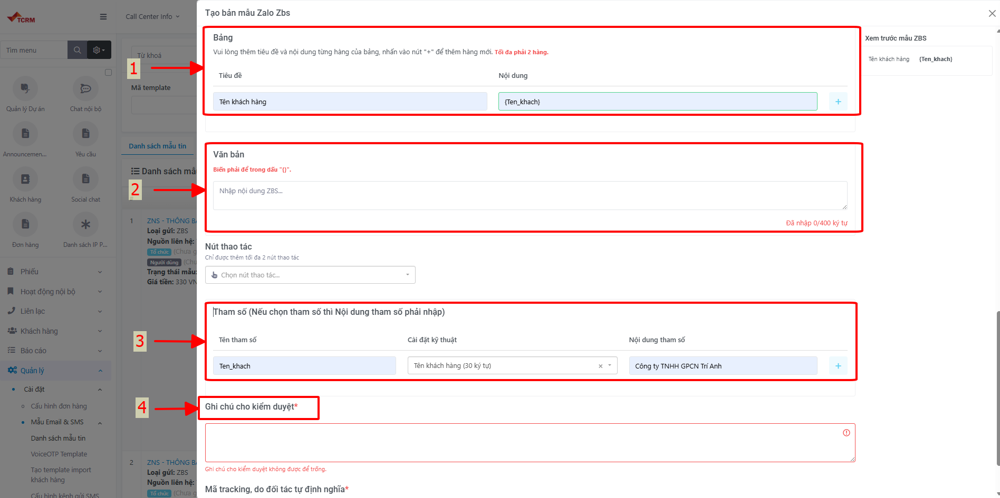

# ZBS Template

**ZBS (Zalo Business Solutions)** là giải pháp gửi tin nhắn thông báo tự động từ Zalo OA tới người dùng đã được Zalo phê duyệt. Tính năng này trên TCRM giúp Quản trị viên khởi tạo và nộp duyệt các mẫu cấu trúc tin nhắn trực tiếp với Zalo.

## Điều kiện tiên quyết

* [ ] Tài khoản Zalo OA của doanh nghiệp đã được xác thực và kết nối thành công với hệ thống hệ sinh thái TCRM.
* [ ] Tài khoản người dùng có quyền Quản trị viên (Admin) để truy cập menu cài đặt.
* [ ] Tệp hình ảnh Logo thương hiệu chuẩn kích thước **400x96 px** (Yêu cầu nền trong suốt/xóa phông nền).

***

## 1. Quy trình tạo Mẫu Tùy Chỉnh

Mẫu Tùy Chỉnh là loại template cơ bản dùng để gửi các thông báo thông thường, giao dịch hoặc chăm sóc khách hàng.

### Bước 1: Khởi tạo bản mẫu mới

1. Tại giao diện chính của CRM, nhấp chọn biểu tượng **Mẫu Email, SMS, ZNS** trên menu hệ thống.
2. Nhấp chọn biểu tượng **Dấu cộng (+)** ở góc giao diện để thêm mới.
3. Nhấp chọn **Tạo bản mẫu Zalo ZBS** trong danh sách đổ xuống.

.png>) _Hình 1: Truy cập menu Mẫu Email, SMS, ZNS_

.png>) _Hình 2: Thao tác khởi tạo template mới_

### Bước 2: Thiết lập thông tin và nội dung

Tại màn hình tạo mới, tiến hành nhập các thông số định dạng cho Template theo bảng sau:

| Thông số               | Cách thiết lập                                                                                                                                                                     |
| ---------------------- | ---------------------------------------------------------------------------------------------------------------------------------------------------------------------------------- |
| **Tên mẫu ZBS**        | Nhập tên gọi nội bộ để dễ dàng nhận diện và quản lý (VD: `Thong_bao_don_hang`).                                                                                                    |
| **Nguồn liên hệ**      | Chọn tài khoản **Zalo OA** của doanh nghiệp.                                                                                                                                       |
| **Loại ZBS**           | Chọn **Mẫu Tùy Chỉnh**.                                                                                                                                                            |
| **Mục đích**           | Chọn phân loại mục đích tương ứng (VD: Giao dịch, Thông báo CSKH).                                                                                                                 |
| **Logo**               | Nhấp tải lên hình ảnh Logo (Kích thước chuẩn **400x96 px**).                                                                                                                       |
| **Tiêu đề & Văn bản**  | Nhập nội dung văn bản thông báo. Nếu dùng tham số dữ liệu động, đặt tên tham số trong dấu đóng mở ngoặc nhọn `{}` (VD: `{ten_khach_hang}`). _Yêu cầu phải có ít nhất 1 ô văn bản._ |
| **Phần Bảng**          | Nhập **Tiêu đề** (Tên label hiển thị) và **Nội dung** (Giá trị hoặc tham số chứa ngoặc nhọn `{}`). Nhấp dấu **(+)** để thêm hàng bảng mới.                                         |
| **Nút thao tác**       | (Tùy chọn) Chọn và thiết lập loại nút bấm điều hướng khách hàng.                                                                                                                   |
| **Tham số**            | Hệ thống tự động trích xuất các biến `{}` từ ô văn bản. Tuyệt đối **không xóa** các dấu ngoặc nhọn tại trường này.                                                                 |
| **Ghi chú kiểm duyệt** | Nhập giải thích ngắn gọn mục đích gửi tin cho đội ngũ thẩm định của Zalo (VD: _Template dùng để gửi mã đơn hàng cho khách_).                                                       |
| **Mã tracking**        | Giữ nguyên theo mặc định (Mã do hệ thống tự sinh).                                                                                                                                 |

.png>) _Hình 3: Thiết lập các trường thông tin cơ bản_

.png>) _Hình 4: Thiết lập hình ảnh và nội dung tin nhắn_

.png>) _Hình 5: Hoàn thiện tham số và ghi chú kiểm duyệt_

### Bước 3: Nộp duyệt lên Zalo

Sau khi kiểm tra bề mặt hiển thị xem trước, nhấp nút **Tạo** để lưu bản nháp và tự động gửi yêu cầu phê duyệt sang hệ thống Zalo.

***

## 2. Quy trình tạo Mẫu Yêu cầu thanh toán

Mẫu Yêu cầu thanh toán chuyên dùng cho các thông báo thu phí, thông báo nợ cước và yêu cầu tuân thủ nghiêm ngặt quy định tài chính của Zalo.

### Bước 1: Khởi tạo

Thực hiện tương tự Bước 1 của [Mẫu Tùy Chỉnh](zalo-oa.md#1-quy-trinh-tao-mau-tuy-chinh). Tại ô **Loại ZBS**, nhấp chọn **Yêu cầu thanh toán**.

### Bước 2: Khai báo thông tin tài khoản ngân hàng


**Quy định kiểm soát tài khoản ngân hàng**

* Tài khoản nhận tiền bắt buộc phải **đứng tên chính doanh nghiệp** sở hữu Zalo OA đó.
* Nếu ủy quyền cho pháp nhân thứ 3 thu hộ, bắt buộc khai báo văn bản/hợp đồng ủy quyền vào mục **Ghi chú** hoặc gửi biểu mẫu xác nhận riêng lên trang Hỗ trợ ZBS.


Tiếp tục khai báo phần **Bảng**, **Văn bản** và **Tham số** như bình thường. Cuối cùng, nhấp **Tạo** để nộp duyệt. 


**Theo dõi trạng thái kiểm duyệt** Bạn có thể theo dõi tiến độ duyệt mẫu tại danh sách quản lý chung:

* 🟢 **Được duyệt:** Template được kích hoạt, sẵn sàng ghép vào chiến dịch gửi tin.
* 🔴 **Từ chối:** Nhấp vào xem thông báo lỗi, tiến hành chỉnh sửa và tạo lại mẫu mới.


.png>)

***

## 3. Quy trình tạo Mẫu Đánh giá dịch vụ

Mẫu Đánh giá dịch vụ tích hợp sẵn module khảo sát, hiển thị các thang điểm đánh giá ngay trong màn hình chat của Khách hàng.

### Bước 1: Khởi tạo

Thực hiện thao tác thêm Template mới và chọn **Loại ZBS** là **Đánh giá dịch vụ**.

### Bước 2: Cấu hình bảng đánh giá

Khai báo các thông số khảo sát theo bảng sau:

| Thông số                | Cách thiết lập                                                                                                                                                                                                                                                         |
| ----------------------- | ---------------------------------------------------------------------------------------------------------------------------------------------------------------------------------------------------------------------------------------------------------------------- |
| **Câu hỏi đánh giá**    | Nhập câu hỏi khảo sát ngắn gọn (VD: _Bạn đánh giá như thế nào về tổng đài viên hôm nay?_).                                                                                                                                                                             |
| **Loại đánh giá**       | 
Chọn 1 trong 3 cơ chế hệ thống cung cấp: 1. <strong>Sao (1-5):</strong> Đánh giá theo mức độ sao phổ biến. 2. <strong>Thang điểm số:</strong> Chấm điểm theo thang phân loại. 3. <strong>Lựa chọn văn bản:</strong> Trắc nghiệm đáp án có sẵn (A/B/C).
 |
| **Câu hỏi phụ**         | (Tùy chọn) Thêm một trường textbox để khách hàng nhập nhận xét tự do của họ.                                                                                                                                                                                           |
| **Phần Bảng & Tham số** | Tiếp tục khai báo tương tự các mẫu thông thường.                                                                                                                                                                                                                       |

.png>)

Nhấp **Tạo** để hoàn tất nộp duyệt cho Zalo.

***

## 4. Quy trình tạo Mẫu Voucher

Mẫu chuyên dụng để phân phối mã ưu đãi, thẻ giảm giá (coupon) dưới định dạng trực quan cho tập khách hàng.

### Bước 1: Khởi tạo

Thêm mới Template và chọn **Loại ZBS** là **Voucher**.

### Bước 2: Cấu hình thông tin Voucher

Tại **Phần Bảng**, yêu cầu khai báo đầy đủ các trường thông tin đặc thù của 1 Voucher:

* Mã giảm giá (Thiết lập tham số `{ma_voucher}`).
* Mức giảm hoặc Giá trị ưu đãi.
* Hạn sử dụng (Thiết lập tham số `{han_su_dung}`).
* Nút thao tác (Nên thêm nút **Xem chi tiết** hoặc **Dùng ngay** trỏ liên kết về Website/App đặt hàng).

.png>)

Sau khi hoàn thiện hình thức, nhấp **Tạo** để hoàn tất nộp duyệt.

***

## 5. Quy trình tạo Mẫu Xác thực (OTP)

Mẫu Xác thực được Zalo áp dụng độ ưu tiên phân phối cao nhất, chuyên dành cho luồng gửi mã OTP bảo mật, đăng nhập hoặc liên kết tài khoản.

### Bước 1: Khởi tạo

Thêm mới Template và chọn **Loại ZBS** là **Xác thực**.

### Bước 2: Cấu hình biến mã xác thực

Tại phần **Văn bản** và **Bảng**, thiết lập cấu trúc bắt buộc:

* Thông báo ngữ cảnh gửi sinh mã (VD: _Mã OTP xác thực đăng nhập tài khoản của bạn_).
* Tham số động chứa mã OTP chính sinh ra từ hệ thống.
* Thời gian hiệu lực khả dụng của mã.


Nội dung của Mẫu Xác thực yêu cầu tính cô đọng tuyệt đối. Không chèn các thông tin không liên quan để tránh bị hệ thống kiểm duyệt AI của Zalo đánh trượt hoặc chuyển xuống tốc độ gửi của tin nhắn phổ thông.


.png>)

Nhấp **Tạo** để gửi lệnh nộp duyệt Template OTP.
