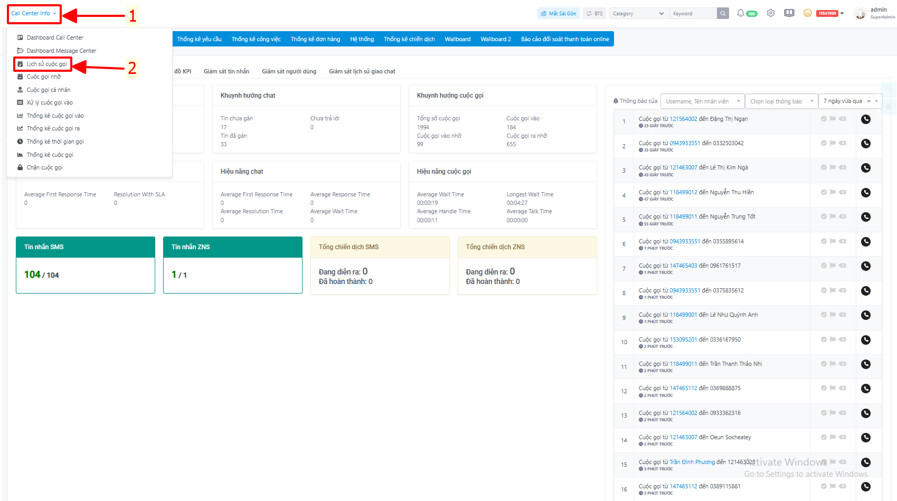
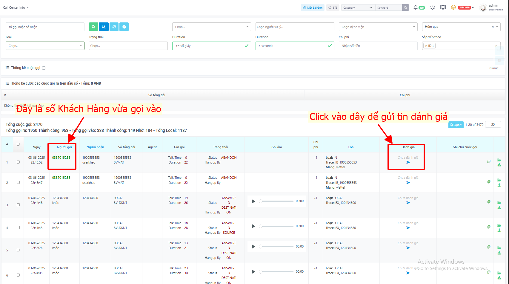
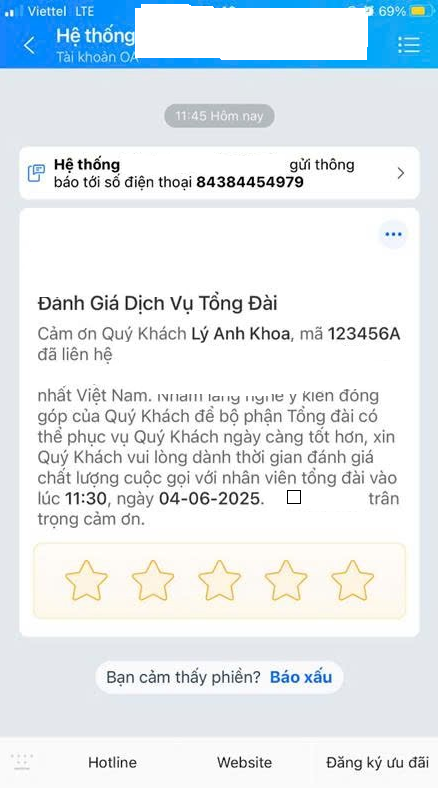
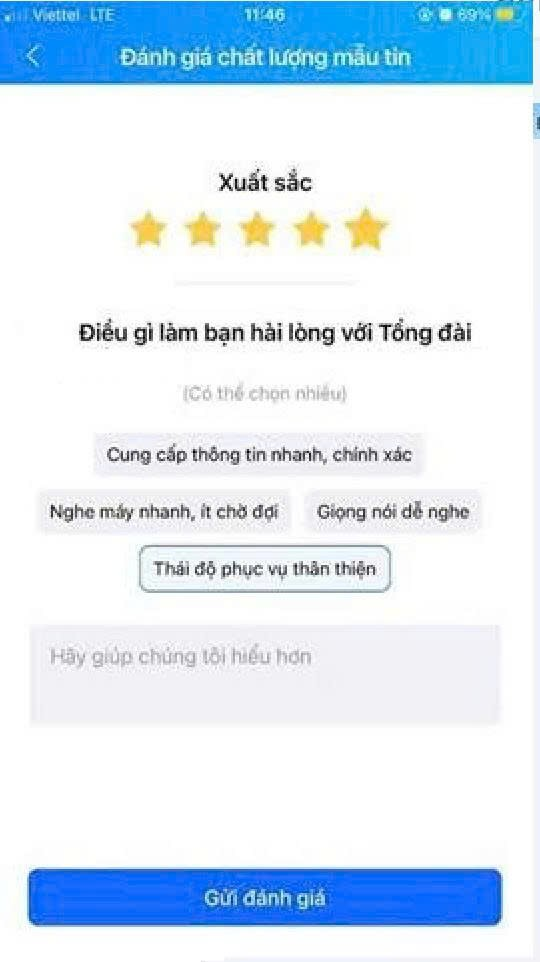
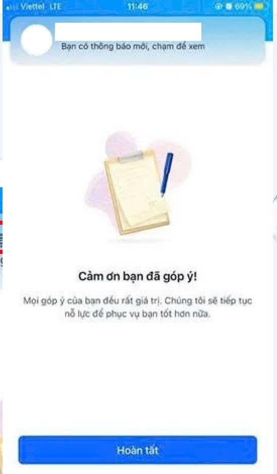
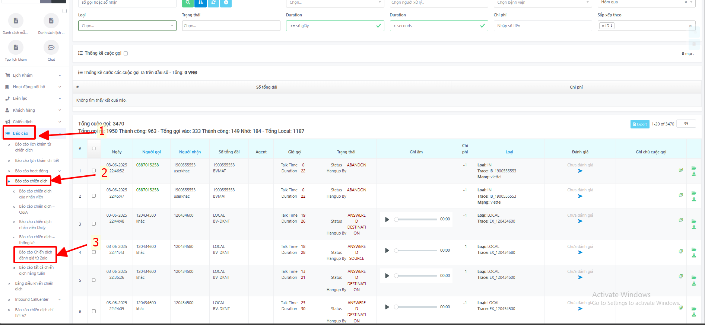
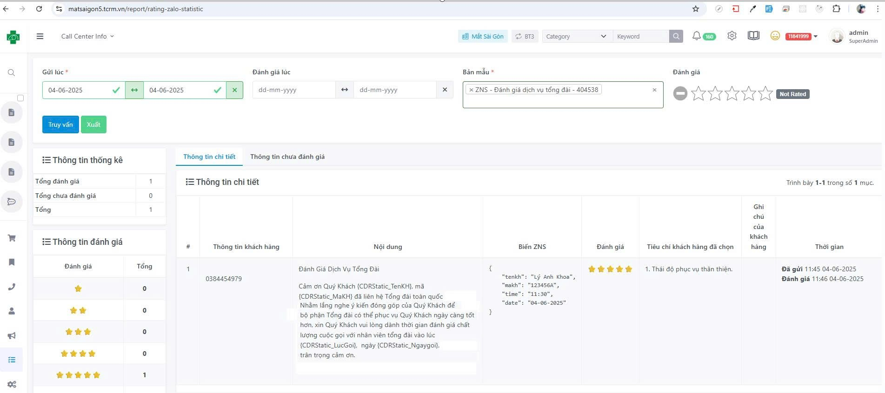
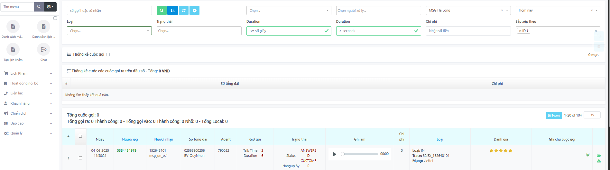

# Hướng dẫn gửi Đánh giá Cuộc gọi

Tính năng đánh giá cuộc gọi cho phép nhân viên gửi đánh giá chất lượng dịch vụ đến Khách Hàng sau khi kết thúc cuộc gọi.

## Điều kiện tiên quyết
* [ ] Đã đăng nhập vào hệ thống tổng đài TCRM.
* [ ] Có quyền truy cập menu Call Center Info và Báo cáo.

## I. Truy cập vào trang quản lý tổng đài

1. Truy cập đường dẫn: `<domain>.tcrm.vn`.
2. Tại giao diện chính, chọn **Call Center Info** ở góc trái màn hình.
   
3. Nhấn vào mục **Lịch sử cuộc gọi** để truy cập vào danh sách cuộc gọi đến từ Khách Hàng.

## II. Thực hiện gửi đánh giá cho Khách Hàng

1. Ở trang **Lịch sử cuộc gọi**, tìm số điện thoại của Khách Hàng vừa gọi đến tổng đài.
2. Tại cột **Đánh giá**, nhấn vào nút mũi tên để mở ô nhập thông tin.
3. Nhập nội dung muốn gửi cho Khách Hàng.
4. Nhấn nút **Gửi** để hệ thống gửi nội dung đánh giá đến Zalo của Khách Hàng.
   

## III. Khách Hàng phản hồi đánh giá

1. Sau khi gửi thành công, Khách Hàng sẽ nhận được nội dung đánh giá qua Zalo.
   
2. Khách Hàng có thể click vào và phản hồi trực tiếp các tiêu chí trên Zalo.
   
3. Xác nhận để hoàn tất đánh giá.
   

## IV. Xem lại kết quả đánh giá từ Khách Hàng

1. Vào mục **Báo cáo** trên thanh menu.
2. Chọn **Báo cáo chiến dịch** → **Báo cáo chiến dịch đánh giá từ Zalo**.
   
3. Tại đây, bạn có thể theo dõi toàn bộ phản hồi đánh giá từ Khách Hàng.
   
4. Lúc này ở phần **Lịch sử cuộc gọi** cũng sẽ hiển thị trạng thái đánh giá của Khách Hàng đó để Agent tiện theo dõi.
   
